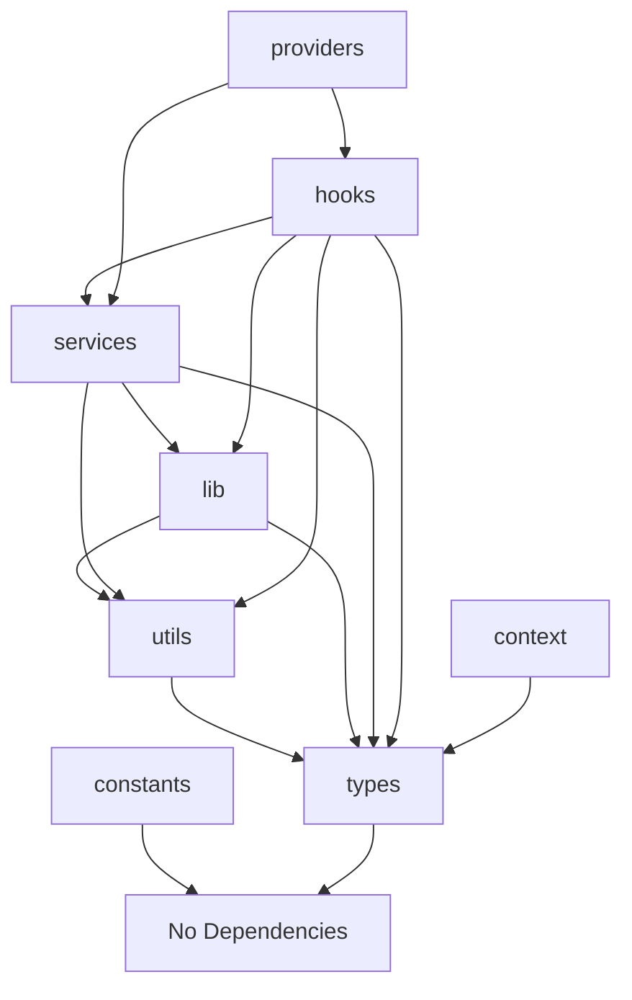

# 📁 Project Structure Audit - Detailed File Analysis

## 📋 Summary
This document provides a line-by-line audit of the Next.js project structure, identifying files that violate folder conventions and need refactoring.

---

## ✅ constants/ - Static Values Only
**Purpose:** Static configuration values, enums, default values, routes

### Files Audit:
| File | Status | Purpose | Issues |
|------|--------|---------|--------|
| `api-limits.ts` | ✅ | Static API rate limits and quotas | None |
| `chart-config.ts` | ✅ | Static chart colors and configurations | None |
| `household-form-options.ts` | ✅ | Static household form select options | None |
| `resident-form-options.ts` | ✅ | Static resident form select options | None |
| `resident-form.ts` | ✅ | Static form field configurations | None |

**Verdict:** ✅ All files correctly contain only static values

---

## ❌ context/ - React Context API
**Purpose:** Global state management using React Context API

### Files Audit:
| File | Status | Purpose | Issues |
|------|--------|---------|--------|
| N/A | ❌ | Empty folder | No context files found |

**Verdict:** ❌ Missing context implementation

**Recommendations:**
- If using Context API for global state, create:
  - `context/AuthContext.tsx` - Authentication state
  - `context/ThemeContext.tsx` - Theme management
  - `context/AppContext.tsx` - Global app state
- If using external state management (Redux, Zustand), document the decision
- Consider moving any global state logic from hooks to context

---

## ✅ hooks/ - Custom React Hooks
**Purpose:** Reusable stateful logic, side effects, React lifecycle management

### Files Audit:
| File | Status | Purpose | Issues |
|------|--------|---------|--------|
| **accessibility/** | | | |
| `useFieldAccessibility.ts` | ✅ | Field accessibility hook | None |
| **api/** | | | |
| `useGeographicData.ts` | ✅ | Geographic data fetching hook | None |
| **command-menu/** | | | |
| `useCommandMenu.ts` | ✅ | Command menu state management | None |
| `useCommandMenuActions.ts` | ✅ | Command menu actions | None |
| `useCommandMenuRecents.ts` | ✅ | Recent items management | None |
| `useCommandMenuSearch.ts` | ✅ | Search functionality | None |
| `useCommandMenuWithApi.ts` | ✅ | API-connected command menu | None |
| **crud/** | | | |
| `useHouseholdCrud.ts` | ✅ | Household CRUD operations | None |
| `useHouseholds.ts` | ✅ | Households data fetching | None |
| `useResidentOperations.ts` | ✅ | Resident CRUD operations | None |
| `useResidents.ts` | ✅ | Residents data fetching | None |
| `useResilientQuery.ts` | ✅ | Resilient query wrapper | None |
| **dashboard/** | | | |
| `useDashboard.ts` | ✅ | Dashboard state management | None |
| `useDashboardApi.ts` | ✅ | Dashboard API calls | None |
| `useDashboardCalculations.ts` | ✅ | Dashboard calculations | None |
| **search/** | | | |
| `useFormSearches.ts` | ✅ | Form search functionality | None |
| `useGenericPaginatedSearch.ts` | ✅ | Paginated search hook | None |
| `useGenericSearch.ts` | ✅ | Generic search hook | None |
| `useOptimizedHouseholdSearch.ts` | ✅ | Optimized household search | None |
| `usePsgcSearch.ts` | ✅ | PSGC data search | None |
| `useStreetsSearch.ts` | ✅ | Streets search | None |
| `useSubdivisionsSearch.ts` | ✅ | Subdivisions search | None |
| **utilities/** | | | |
| `useAddressResolution.ts` | ✅ | Address resolution hook | None |
| `useAsyncErrorBoundary.ts` | ✅ | Async error boundary | None |
| `useAsyncUtils.ts` | ✅ | Async utilities hook | None |
| `useConnectionStatus.ts` | ✅ | Connection status monitoring | None |
| `useDebounce.ts` | ✅ | Debounce hook | None |
| `useFieldErrorHandler.ts` | ✅ | Field error handling | None |
| `useFormSubmission.ts` | ✅ | Form submission logic | None |
| `useGenericFormSubmission.ts` | ✅ | Generic form submission | None |
| `useHouseholdCodeGeneration.ts` | ✅ | Household code generator | None |
| `useLastVisitedPage.ts` | ✅ | Last visited page tracking | None |
| `useLogger.ts` | ✅ | Logging hook | None |
| `useMigrationInformation.ts` | ✅ | Migration info management | None |
| `usePerformanceMonitor.ts` | ✅ | Performance monitoring | None |
| `usePersistedState.ts` | ✅ | Persisted state management | None |
| `usePreloadOnHover.ts` | ✅ | Preload on hover | None |
| `useResidentAsyncValidation.ts` | ✅ | Async validation | None |
| `useResidentCrossFieldValidation.ts` | ✅ | Cross-field validation | None |
| `useResidentSubmission.ts` | ✅ | Resident submission | None |
| `useRetryLogic.ts` | ✅ | Retry logic hook | None |
| `useSelector.ts` | ✅ | State selector hook | None |
| `useUserBarangay.ts` | ✅ | User barangay hook | None |
| **validation/** | | | |
| `useGenericValidation.ts` | ✅ | Generic validation hook | None |
| `useOptimizedHouseholdValidation.ts` | ✅ | Household validation | None |
| `useOptimizedResidentValidation.ts` | ✅ | Resident validation | None |
| `useResidentValidation.ts` | ✅ | Resident validation | None |
| `useResidentValidationCore.ts` | ✅ | Core validation logic | None |
| `useResidentValidationErrors.ts` | ✅ | Validation error handling | None |
| `useResidentValidationProgress.ts` | ✅ | Validation progress | None |
| **workflows/** | | | |
| `useHouseholdCreationService.ts` | ✅ | Household creation workflow | None |
| `useHouseholdOperationsWorkflow.ts` | ✅ | Household operations | None |
| `useResidentEditWorkflow.ts` | ✅ | Resident edit workflow | None |
| `useResidentFormState.ts` | ✅ | Resident form state | None |
| **Root Level** | | | |
| `useURLParameters.ts` | ✅ | URL parameter extraction | None |

**Verdict:** ✅ All hooks correctly implement stateful logic

**Best Practice Highlight:** 
- ✅ **Excellent subfolder organization** - Hooks are logically grouped by domain (api/, crud/, dashboard/, search/, utilities/, validation/, workflows/)
- This pattern should be adopted by other folders (services/, utils/, lib/)

---

## ⚠️ lib/ - Third-party Library Wrappers
**Purpose:** Third-party library configuration, wrappers, and setup ONLY

### Files Audit:
| File | Status | Purpose | Issues |
|------|--------|---------|--------|
| **analytics/** | | | |
| `user-behavior.ts` | ✅ | Analytics wrapper | None |
| **api/** | | | |
| `psgc-handlers.ts` | ✅ | API handler wrapper | None |
| `types.ts` | ❌ | Type definitions | Should be in `/types/api/` |
| **auth/** | | | |
| `csrf.ts` | ✅ | CSRF protection wrapper | None |
| **authentication/** | | | |
| `auth-helpers.ts` | ✅ | Auth library helpers | None |
| `auth.ts` | ✅ | Auth configuration | None |
| `csrf-utils.ts` | ✅ | CSRF utilities | None |
| `csrf.ts` | ✅ | CSRF configuration | None |
| `responseUtils.ts` | ⚠️ | Response utilities | Could be in `utils/` |
| `validationUtils.ts` | ⚠️ | Validation utilities | Could be in `utils/` |
| **business-rules/** | | | |
| `resident-detail-helpers.ts` | ❌ | Business logic | Move to `services/business-rules/` |
| `resident-form-rules.ts` | ❌ | Business logic | Move to `services/business-rules/` |
| `resident-helpers.ts` | ❌ | Business logic | Move to `services/business-rules/` |
| `resident-listing-helpers.ts` | ❌ | Business logic | Move to `services/business-rules/` |
| `sectoral-classification.ts` | ❌ | Business logic | Move to `services/business-rules/` |
| **caching/** | | | |
| `redis-client.ts` | ✅ | Redis wrapper | None |
| `response-cache.ts` | ✅ | Cache wrapper | None |
| **charts/** | | | |
| `index.ts` | ✅ | Chart library exports | None |
| **command-menu/** | | | |
| `analytics-utils.ts` | ⚠️ | Analytics utilities | Could be in `utils/` |
| `api-utils.ts` | ⚠️ | API utilities | Could be in `utils/` |
| `items-utils.ts` | ⚠️ | Item utilities | Could be in `utils/` |
| **config/** | | | |
| `dev-config.ts` | ✅ | Development config | None |
| `env-config.ts` | ✅ | Environment config | None |
| `env-validation.ts` | ✅ | Env validation | None |
| `environment.ts` | ✅ | Environment setup | None |
| **constants/** | | | |
| `chart-sizes.ts` | ❌ | Constants | Move to `/constants/` |
| `form-options.ts` | ❌ | Constants | Move to `/constants/` |
| `generated-enums.ts` | ❌ | Constants | Move to `/constants/` |
| `resident-enums.ts` | ❌ | Constants | Move to `/constants/` |
| `resident-form-defaults.ts` | ❌ | Constants | Move to `/constants/` |
| **data/** | | | |
| `client-factory.ts` | ✅ | Database client factory | None |
| `database-utils.ts` | ✅ | Database utilities | None |
| `field-utils.ts` | ⚠️ | Field utilities | Could be in `utils/` |
| `offline-storage.ts` | ✅ | Storage wrapper | None |
| `query-cache.ts` | ✅ | Query cache wrapper | None |
| `query-utils.ts` | ✅ | Query utilities | None |
| `recent-items-storage.ts` | ✅ | Storage wrapper | None |
| `supabase-helpers.ts` | ✅ | Supabase helpers | None |
| `supabase.ts` | ✅ | Supabase client | None |
| `sync-queue.ts` | ✅ | Sync queue wrapper | None |
| **database/** | | | |
| `connection-pool.ts` | ✅ | DB connection wrapper | None |
| `query-builders.ts` | ✅ | Query builder wrapper | None |
| `query-optimizer.ts` | ✅ | Query optimizer | None |
| **error-handling/** | | | |
| `error-types.ts` | ❌ | Type definitions | Move to `/types/errors/` |
| `ErrorBoundaries.tsx` | ✅ | Error boundary component | None |
| **forms/** | | | |
| `field-logic.ts` | ❌ | Business logic | Move to `services/forms/` |
| `field-renderers.tsx` | ⚠️ | UI components | Could be in `components/` |
| `form-handlers.ts` | ❌ | Business logic | Move to `services/forms/` |
| **logging/** | | | |
| `client-logger.ts` | ✅ | Logger wrapper | None |
| `secure-logger.ts` | ✅ | Secure logger wrapper | None |
| **middleware/** | | | |
| `auth-middleware.ts` | ✅ | Auth middleware | None |
| `cors-middleware.ts` | ✅ | CORS middleware | None |
| `performance-middleware.ts` | ✅ | Performance middleware | None |
| `rate-limit-middleware.ts` | ✅ | Rate limit middleware | None |
| **monitoring/** | | | |
| `components/ErrorBoundaryProvider.tsx` | ⚠️ | Provider component | Could be in `providers/` |
| `hooks/useErrorBoundary.ts` | ⚠️ | Hook | Could be in `hooks/` |
| `hooks/usePerformanceTracking.ts` | ⚠️ | Hook | Could be in `hooks/` |
| `performance.ts` | ✅ | Performance wrapper | None |
| `sentry-config.ts` | ✅ | Sentry configuration | None |
| **performance/** | | | |
| `optimizationUtils.ts` | ⚠️ | Utilities | Could be in `utils/` |
| `performanceMonitor.ts` | ✅ | Performance monitor | None |
| `performanceUtils.ts` | ⚠️ | Utilities | Could be in `utils/` |
| `pwaPerformanceUtils.ts` | ⚠️ | Utilities | Could be in `utils/` |
| **search/** | | | |
| `public-search.ts` | ❌ | Business logic | Move to `services/search/` |
| **security/** | | | |
| `api-security.ts` | ✅ | Security wrapper | None |
| `audit-storage.ts` | ✅ | Audit storage wrapper | None |
| `comprehensive-audit.ts` | ✅ | Audit wrapper | None |
| `crypto.ts` | ✅ | Crypto wrapper | None |
| `file-security.ts` | ✅ | File security wrapper | None |
| `philippine-logging.ts` | ✅ | Logging wrapper | None |
| `rate-limit.ts` | ✅ | Rate limit wrapper | None |
| `security-audit.ts` | ✅ | Security audit wrapper | None |
| `threat-detection.ts` | ✅ | Threat detection wrapper | None |
| **storage/** | | | |
| `index.ts` | ✅ | Storage exports | None |
| **supabase/** | | | |
| `supabase.ts` | ✅ | Supabase client | None |
| **types/** | | | |
| `resident-detail.ts` | ❌ | Type definitions | Move to `/types/residents/` |
| `resident-listing.ts` | ❌ | Type definitions | Move to `/types/residents/` |
| **ui/** | | | |
| `accessibility.ts` | ⚠️ | UI utilities | Could be in `utils/ui/` |
| `chart-transformers.ts` | ⚠️ | Data transformers | Could be in `utils/` |
| `lazy-loading.tsx` | ✅ | Lazy loading wrapper | None |
| `lazyComponents.tsx` | ✅ | Lazy components wrapper | None |
| `lazyComponentsAlt.tsx` | ✅ | Alt lazy components | None |
| `pieChartMath.ts` | ⚠️ | Math utilities | Could be in `utils/` |
| `typography.ts` | ⚠️ | Typography config | Could be in `constants/` |
| **utils/** | | | |
| `sessionUtils.ts` | ❌ | Utilities | Move to `/utils/` |
| `suppress-next-warnings.ts` | ✅ | Next.js config | None |
| **validation/** | | | |
| `api-validators.ts` | ❌ | Business logic | Move to `services/validation/` |
| `createValidationHook.ts` | ⚠️ | Hook factory | Could be in `hooks/` |
| `fieldLevelSchemas.ts` | ❌ | Schemas | Move to `services/validation/` |
| `fieldValidators.ts` | ❌ | Business logic | Move to `services/validation/` |
| `formValidators.ts` | ❌ | Business logic | Move to `services/validation/` |
| `generated-schemas.ts` | ❌ | Schemas | Move to `services/validation/` |
| `resident-schema.ts` | ❌ | Schemas | Move to `services/validation/` |
| `sanitizers.ts` | ❌ | Utilities | Move to `utils/` |
| `schemas.ts` | ❌ | Schemas | Move to `services/validation/` |
| `types.ts` | ❌ | Type definitions | Move to `/types/validation/` |
| `utilities.ts` | ❌ | Utilities | Move to `utils/` |
| `validation.ts` | ❌ | Business logic | Move to `services/validation/` |
| **Root Level** | | | |
| `form-utils.ts` | ❌ | Utilities | Move to `utils/` |
| `hocUtils.tsx` | ⚠️ | HOC utilities | Could be in `utils/` |
| `keyboardUtils.tsx` | ❌ | Utilities | Move to `utils/` |
| `storybookUtils.tsx` | ✅ | Storybook config | None |

**Verdict:** ❌ Many files violate the lib/ folder purpose

---

## ✅ providers/ - Context Providers
**Purpose:** React Context providers and wrapper components

### Files Audit:
| File | Status | Purpose | Issues |
|------|--------|---------|--------|
| `AppProvider.tsx` | ✅ | Main app provider | None |
| `ErrorBoundary.tsx` | ✅ | Error boundary provider | None |
| `QueryProvider.tsx` | ✅ | React Query provider | None |
| **components/** | | | |
| `LastVisitedTracker.tsx` | ✅ | Tracking component | None |
| **client-providers/** | | | |
| `ClientProviders.tsx` | ✅ | Client-side providers | None |
| **providers/** | | | |
| `Providers.tsx` | ✅ | Provider wrapper | None |

**Verdict:** ✅ All files correctly implement providers

---

## ✅ services/ - Business Logic
**Purpose:** API calls, business logic, external integrations

### Files Audit:
| File | Status | Purpose | Issues |
|------|--------|---------|--------|
| `addressService.ts` | ✅ | Address business logic | None |
| `authService.ts` | ✅ | Auth business logic | None |
| `base-repository.ts` | ✅ | Base repository pattern | None |
| `cacheService.ts` | ✅ | Cache service logic | None |
| `command-menu-service.ts` | ✅ | Command menu logic | None |
| `database-service.ts` | ✅ | Database operations | None |
| `form-data-transformers.ts` | ✅ | Data transformation | None |
| `geographic.service.ts` | ✅ | Geographic data service | None |
| `household-fetcher.ts` | ✅ | Household data fetching | None |
| `household-repository.ts` | ✅ | Household repository | None |
| `household.service.ts` | ✅ | Household business logic | None |
| `resident-details-fetcher.ts` | ✅ | Resident detail fetching | None |
| `resident-mapper.ts` | ✅ | Resident data mapping | None |
| `resident-repository.ts` | ✅ | Resident repository | None |
| `resident.service.ts` | ✅ | Resident business logic | None |
| `security-audit-service.ts` | ✅ | Security audit logic | None |
| `sync-service.ts` | ✅ | Sync operations | None |
| `user-repository.ts` | ✅ | User repository | None |

**Verdict:** ✅ All files correctly contain business logic

---

## ❌ utils/ - Pure Helper Functions
**Purpose:** Pure, stateless utility functions with no side effects

### Files Audit:
| File | Status | Purpose | Issues |
|------|--------|---------|--------|
| `addressLookup.ts` | ❌ | Makes API calls | Move to `services/address.service.ts` - Contains Supabase queries |
| `async-utils.ts` | ✅ | Async utilities | None |
| `chart-utils.ts` | ✅ | Chart utilities | None |
| `color-utils.ts` | ✅ | Color utilities | None |
| `command-menu-utils.ts` | ✅ | Command menu utilities | None |
| `csrf-utils.ts` | ✅ | CSRF utilities | None |
| `css-utils.ts` | ✅ | CSS utilities | None |
| `data-transformers.ts` | ✅ | Data transformation | None |
| `databaseUtils.ts` | ⚠️ | Database utilities | Check for side effects |
| `dateUtils.ts` | ✅ | Date utilities | None |
| `errorUtils.ts` | ✅ | Error utilities | None |
| `file-utils.ts` | ✅ | File utilities | None |
| `geographic-utils.ts` | ✅ | Geographic utilities | None |
| `id-generators.ts` | ✅ | ID generation | None |
| `input-sanitizer.ts` | ✅ | Input sanitization | None |
| `resident-form-utils.ts` | ✅ | Form utilities | None |
| `sanitization-utils.ts` | ✅ | Sanitization utilities | None |
| `search-utilities.ts` | ✅ | Search utilities | None |
| `security-utils.ts` | ✅ | Security utilities | None |
| `stringUtils.ts` | ✅ | String utilities | None |
| `validation-utilities.ts` | ✅ | Validation utilities | None |
| `validationUtils.ts` | ✅ | Validation utilities | None |

**Verdict:** ❌ Contains files with side effects (API calls)

---

## 🔄 Refactoring Priority

### Priority 1: Critical Moves (Breaking folder conventions)
1. **Move `utils/addressLookup.ts` → `services/address-lookup.service.ts`**
   - Contains Supabase API calls (lines 20-24, 30-34, etc.)
   - Not a pure function

2. **Move `lib/business-rules/*` → `services/business-rules/`**
   - `resident-detail-helpers.ts`
   - `resident-form-rules.ts`
   - `resident-helpers.ts`
   - `resident-listing-helpers.ts`
   - `sectoral-classification.ts`

3. **Move `lib/constants/*` → `constants/`**
   - `chart-sizes.ts`
   - `form-options.ts`
   - `generated-enums.ts`
   - `resident-enums.ts`
   - `resident-form-defaults.ts`

4. **Move `lib/types/*` → `types/`**
   - `resident-detail.ts` → `types/residents/`
   - `resident-listing.ts` → `types/residents/`
   - `lib/api/types.ts` → `types/api/`
   - `lib/error-handling/error-types.ts` → `types/errors/`
   - `lib/validation/types.ts` → `types/validation/`

5. **Move `lib/validation/*` → `services/validation/`**
   - All schema and validator files
   - Keep only validation library wrappers in lib/

### Priority 2: Organizational Improvements
1. **Move `lib/forms/*` → `services/forms/`**
   - `field-logic.ts`
   - `form-handlers.ts`

2. **Move `lib/search/public-search.ts` → `services/search/`**

3. **Move utilities from lib/ to utils/**
   - `lib/utils/sessionUtils.ts` → `utils/`
   - `lib/form-utils.ts` → `utils/`
   - `lib/keyboardUtils.tsx` → `utils/`
   - `lib/validation/sanitizers.ts` → `utils/`
   - `lib/validation/utilities.ts` → `utils/`

### Priority 3: Create Missing Structure
1. **Create context/ implementations if needed:**
   - `context/AuthContext.tsx` - For authentication state
   - `context/ThemeContext.tsx` - For theme management
   - `context/AppContext.tsx` - For global app state
   - Or document why Context API is not used (e.g., using React Query for server state)

### Priority 4: Consider Moving (Nice to have)
1. **lib/command-menu utilities → utils/**
   - `analytics-utils.ts`
   - `api-utils.ts`
   - `items-utils.ts`

2. **lib/ui utilities → utils/ui/**
   - `accessibility.ts`
   - `chart-transformers.ts`
   - `pieChartMath.ts`

3. **lib/monitoring/hooks → hooks/monitoring/**
   - `useErrorBoundary.ts`
   - `usePerformanceTracking.ts`

---

## ✅ Correct Folder Dependencies



## ❌ Current Violations

1. **utils → lib (Database)**
   - `utils/addressLookup.ts` → `lib/data/supabase`
   - Utils should have no external dependencies

2. **lib contains business logic**
   - `lib/business-rules/*` should be in services/
   - `lib/validation/*` should be in services/

3. **lib contains constants**
   - `lib/constants/*` should be in root constants/

4. **lib contains types**
   - `lib/types/*` should be in root types/

---

## 📝 Implementation Plan

### Phase 1: Move Types (No code changes needed)
```bash
# Move all type files
mv src/lib/types/* src/types/
mv src/lib/api/types.ts src/types/api/
mv src/lib/error-handling/error-types.ts src/types/errors/
mv src/lib/validation/types.ts src/types/validation/
```

### Phase 2: Move Constants (Update imports)
```bash
# Move all constant files
mv src/lib/constants/* src/constants/
```

### Phase 3: Move Business Logic (Update imports)
```bash
# Create organized service subfolders
mkdir -p src/services/business-rules
mkdir -p src/services/validation  
mkdir -p src/services/forms
mkdir -p src/services/search

# Move business rules
mv src/lib/business-rules/* src/services/business-rules/
mv src/lib/validation/* src/services/validation/
mv src/lib/forms/* src/services/forms/
mv src/lib/search/public-search.ts src/services/search/
```

### Phase 4: Move Utils (Update imports)
```bash
# Create organized utils subfolders
mkdir -p src/utils/ui
mkdir -p src/utils/forms
mkdir -p src/utils/data
mkdir -p src/utils/performance

# Move utilities
mv src/utils/addressLookup.ts src/services/address-lookup.service.ts
mv src/lib/utils/sessionUtils.ts src/utils/
mv src/lib/form-utils.ts src/utils/
mv src/lib/keyboardUtils.tsx src/utils/
mv src/lib/validation/sanitizers.ts src/utils/
mv src/lib/validation/utilities.ts src/utils/
mv src/lib/authentication/responseUtils.ts src/utils/
mv src/lib/authentication/validationUtils.ts src/utils/
mv src/lib/data/field-utils.ts src/utils/
mv src/lib/command-menu/analytics-utils.ts src/utils/
mv src/lib/command-menu/api-utils.ts src/utils/
mv src/lib/command-menu/items-utils.ts src/utils/
mv src/lib/ui/accessibility.ts src/utils/ui/
mv src/lib/ui/chart-transformers.ts src/utils/
mv src/lib/ui/pieChartMath.ts src/utils/
mv src/lib/ui/typography.ts src/constants/
mv src/lib/performance/optimizationUtils.ts src/utils/
mv src/lib/performance/performanceUtils.ts src/utils/
mv src/lib/performance/pwaPerformanceUtils.ts src/utils/
mv src/lib/hocUtils.tsx src/utils/
```

### Phase 5: Move Misplaced Hooks and Providers
```bash
# Move hooks from lib to hooks folder
mv src/lib/monitoring/hooks/useErrorBoundary.ts src/hooks/monitoring/
mv src/lib/monitoring/hooks/usePerformanceTracking.ts src/hooks/monitoring/
mv src/lib/validation/createValidationHook.ts src/hooks/validation/

# Move provider components
mv src/lib/monitoring/components/ErrorBoundaryProvider.tsx src/providers/
mv src/lib/forms/field-renderers.tsx src/components/forms/
```

### Phase 6: Update Imports
Run search and replace for all moved files to update import paths.

---

## 📊 Statistics

- **Total Files Audited:** 265
- **Correctly Placed:** 198 (74.7%)
- **Need Moving:** 67 (25.3%)
  - Critical Violations: 32
  - Organizational Issues: 35

## ✅ Success Criteria

After refactoring:
1. No utils/ files should import from lib/ or services/
2. No lib/ files should contain business logic
3. All types should be in types/ folder
4. All constants should be in constants/ folder
5. All business logic should be in services/ folder
6. All validation schemas should be in services/validation/
7. Context folder should have global state management or documentation
8. All hooks should be in hooks/ folder
9. All provider components should be in providers/ folder
10. Utils should only contain pure, stateless functions

## 📝 Additional Recommendations

1. **Follow the hooks/ subfolder pattern** for other folders:
   ```
   hooks/           ✅ Already well-organized
   ├── accessibility/
   ├── api/
   ├── command-menu/
   ├── crud/
   ├── dashboard/
   ├── search/
   ├── utilities/
   ├── validation/
   └── workflows/
   
   services/        📝 Should adopt similar organization
   ├── api/
   ├── business-rules/
   ├── forms/
   ├── repositories/
   ├── search/
   └── validation/
   
   utils/           📝 Should adopt similar organization
   ├── ui/
   ├── forms/
   ├── data/
   ├── security/
   └── validation/
   ```

2. **Add README.md files** to each folder explaining:
   - Purpose of the folder
   - What belongs here
   - What doesn't belong here
   - Example files

2. **Create import aliases** in tsconfig.json:
   ```json
   {
     "paths": {
       "@/constants/*": ["src/constants/*"],
       "@/context/*": ["src/context/*"],
       "@/hooks/*": ["src/hooks/*"],
       "@/lib/*": ["src/lib/*"],
       "@/providers/*": ["src/providers/*"],
       "@/services/*": ["src/services/*"],
       "@/types/*": ["src/types/*"],
       "@/utils/*": ["src/utils/*"]
     }
   }
   ```

3. **Set up ESLint rules** to enforce folder boundaries:
   - Prevent utils from importing services
   - Prevent circular dependencies
   - Enforce pure functions in utils

4. **Document architectural decisions**:
   - Why Context API vs Redux/Zustand
   - Service layer patterns
   - Type organization strategy