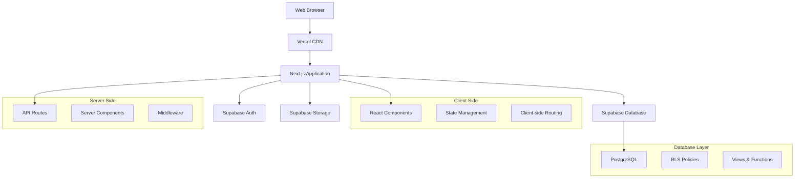
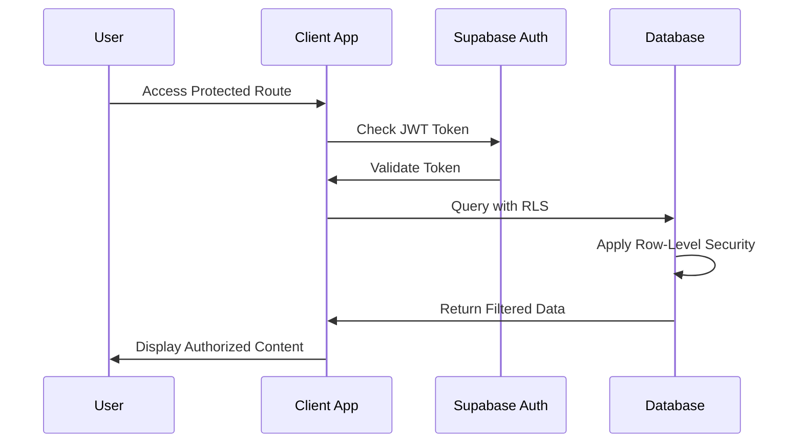
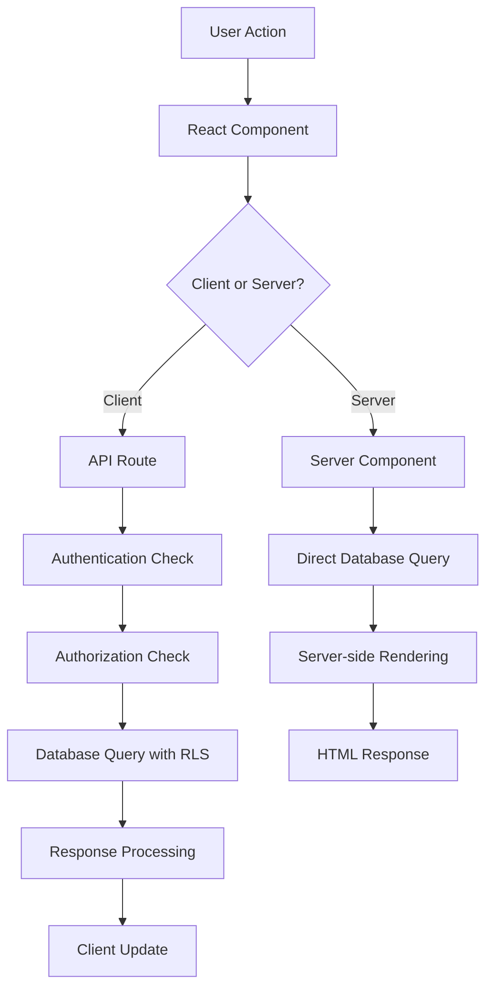
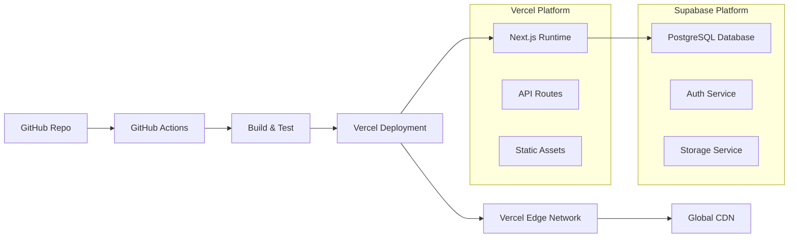

# Architecture Overview

> **System architecture and design decisions for the Citizenly project**
> 
> This document provides a comprehensive overview of the system architecture, technology choices, design patterns, and architectural decisions that shape the Citizenly platform.

## 📖 Table of Contents

1. [🏗️ High-Level Architecture](#️-high-level-architecture)
2. [💻 Technology Stack](#-technology-stack)
3. [🗄️ Database Design](#️-database-design)
4. [🔐 Authentication & Authorization](#-authentication--authorization)
5. [📡 API Architecture](#-api-architecture)
6. [🎨 Frontend Architecture](#-frontend-architecture)
7. [📁 Project Structure](#-project-structure)
8. [🔄 Data Flow](#-data-flow)
9. [🚀 Deployment Architecture](#-deployment-architecture)
10. [🎯 Design Decisions](#-design-decisions)

---

## 🏗️ High-Level Architecture

### **System Overview**
Citizenly is a full-stack web application built with Next.js, providing barangay (village) administration capabilities for the Philippines. The system follows a modern, cloud-native architecture with clear separation of concerns.



### **Core Principles**
- **Serverless-First**: Leverage managed services for scalability
- **Security by Design**: Row-level security and principle of least privilege
- **Performance Optimized**: Edge computing and efficient data fetching
- **Developer Experience**: Type safety and modern tooling
- **Maintainable**: Clear separation of concerns and modular design

---

## 💻 Technology Stack

### **Frontend**
```typescript
// Core Frontend Technologies
{
  "framework": "Next.js 14 (App Router)",
  "runtime": "React 18",
  "language": "TypeScript",
  "styling": "Tailwind CSS",
  "components": "Atomic Design Pattern",
  "stateManagement": "React Context + useReducer",
  "forms": "React Hook Form + Zod",
  "testing": "Jest + React Testing Library + Playwright"
}
```

### **Backend**
```typescript
// Backend Technologies
{
  "runtime": "Next.js API Routes",
  "database": "Supabase (PostgreSQL)",
  "authentication": "Supabase Auth",
  "storage": "Supabase Storage",
  "validation": "Zod schemas",
  "security": "Row Level Security (RLS)",
  "realtime": "Supabase Realtime (future)"
}
```

### **Infrastructure**
```typescript
// Infrastructure & DevOps
{
  "hosting": "Vercel",
  "cdn": "Vercel Edge Network",
  "database": "Supabase Cloud",
  "monitoring": "Vercel Analytics + Supabase Metrics",
  "cicd": "GitHub Actions",
  "secrets": "Vercel Environment Variables"
}
```

### **Development Tools**
```typescript
// Development Ecosystem
{
  "packageManager": "npm",
  "linting": "ESLint + Prettier",
  "typeChecking": "TypeScript Compiler",
  "testing": "Jest + Playwright + Testing Library",
  "documentation": "Storybook (planned)",
  "versionControl": "Git + GitHub"
}
```

---

## 🗄️ Database Design

### **Database Architecture**
```sql
-- Core Entity Relationships
┌─────────────────┐    ┌─────────────────┐    ┌─────────────────┐
│ auth_user_      │    │    residents    │    │   households    │
│ profiles        │───▶│                 │───▶│                 │
│                 │    │ • Personal info │    │ • Address info  │
│ • User auth     │    │ • Demographics  │    │ • Family units  │
│ • Barangay      │    │ • Employment    │    │ • Housing data  │
│ • Roles         │    │ • Education     │    │                 │
└─────────────────┘    └─────────────────┘    └─────────────────┘
         │                       │                       │
         │              ┌─────────────────┐              │
         │              │   Geographic    │              │
         └─────────────▶│   Hierarchy     │◀─────────────┘
                        │                 │
                        │ • Regions       │
                        │ • Provinces     │
                        │ • Cities        │
                        │ • Barangays     │
                        └─────────────────┘
```

### **Key Design Patterns**
- **Row-Level Security**: Multi-tenant data isolation
- **View-Based APIs**: Optimized data access patterns
- **Audit Logging**: Comprehensive change tracking
- **Soft Deletes**: Data preservation and recovery
- **Geographic Hierarchy**: Philippine administrative structure

### **Database Schema Highlights**
```sql
-- Multi-tenant security model
CREATE POLICY "Users can only access their barangay data" 
ON residents FOR ALL 
USING (barangay_code = get_user_barangay_code());

-- Optimized API views
CREATE VIEW api_residents_with_geography AS
SELECT 
  r.*,
  b.name as barangay_name,
  c.name as city_name,
  p.name as province_name
FROM residents r
JOIN psgc_barangays b ON r.barangay_code = b.code
JOIN psgc_cities c ON b.city_code = c.code
JOIN psgc_provinces p ON c.province_code = p.code;

-- Audit trail for compliance
CREATE TABLE audit_log (
  id UUID PRIMARY KEY DEFAULT gen_random_uuid(),
  table_name TEXT NOT NULL,
  operation TEXT NOT NULL,
  old_values JSONB,
  new_values JSONB,
  created_at TIMESTAMP WITH TIME ZONE DEFAULT NOW(),
  created_by UUID REFERENCES auth.users(id)
);
```

---

## 🔐 Authentication & Authorization

### **Authentication Flow**


### **Role-Based Access Control**
```typescript
// User roles and permissions
enum UserRole {
  SUPER_ADMIN = 'super_admin',      // System administration
  BARANGAY_ADMIN = 'barangay_admin', // Barangay management
  RESIDENT = 'resident'              // Basic resident access
}

// Permission matrix
const permissions = {
  [UserRole.SUPER_ADMIN]: [
    'manage_all_barangays',
    'view_system_analytics',
    'manage_users'
  ],
  [UserRole.BARANGAY_ADMIN]: [
    'manage_barangay_residents',
    'view_barangay_analytics',
    'export_barangay_data'
  ],
  [UserRole.RESIDENT]: [
    'view_own_profile',
    'update_own_profile'
  ]
};
```

### **Security Implementation**
```sql
-- Row-level security example
CREATE POLICY "Barangay admins can manage their barangay" 
ON residents FOR ALL 
USING (
  auth.jwt() ->> 'role' = 'barangay_admin' 
  AND barangay_code = get_user_barangay_code()
);

-- Function to get user's barangay
CREATE OR REPLACE FUNCTION get_user_barangay_code()
RETURNS TEXT AS $$
BEGIN
  RETURN (
    SELECT barangay_code 
    FROM auth_user_profiles 
    WHERE id = auth.uid()
  );
END;
$$ LANGUAGE plpgsql SECURITY DEFINER;
```

---

## 📡 API Architecture

### **API Design Principles**
- **RESTful**: Standard HTTP methods and status codes
- **Type-Safe**: Full TypeScript integration
- **Consistent**: Uniform response formats
- **Secure**: Built-in authentication and authorization
- **Documented**: Self-documenting with TypeScript

### **API Structure**
```
/api/
├── auth/                 # Authentication endpoints
│   ├── profile/          # User profile management
│   ├── assign-role/      # Role assignment
│   └── webhook/          # Auth webhooks
├── residents/            # Resident management
│   ├── route.ts          # CRUD operations
│   └── [id]/route.ts     # Individual resident
├── households/           # Household management
│   ├── route.ts          # CRUD operations
│   └── [id]/route.ts     # Individual household
├── addresses/            # Geographic data
│   ├── regions/          # Philippine regions
│   ├── provinces/        # Provinces
│   ├── cities/           # Cities/municipalities
│   └── barangays/        # Barangays
├── dashboard/            # Analytics and stats
│   └── stats/            # Dashboard statistics
└── admin/                # Administrative functions
    └── users/            # User management
```

### **Response Format**
```typescript
// Standardized API response format
interface ApiResponse<T> {
  data?: T;
  error?: string;
  message?: string;
  pagination?: {
    page: number;
    limit: number;
    total: number;
    hasMore: boolean;
  };
}

// Example implementation
export async function GET(request: Request) {
  try {
    const residents = await getResidents();
    return Response.json({
      data: residents,
      message: 'Residents retrieved successfully'
    });
  } catch (error) {
    return Response.json(
      { error: 'Failed to retrieve residents' },
      { status: 500 }
    );
  }
}
```

---

## 🎨 Frontend Architecture

### **Component Architecture**
```
src/components/
├── atoms/              # Basic building blocks
│   ├── Button/
│   ├── Input/
│   ├── Text/
│   └── Icon/
├── molecules/          # Combinations of atoms
│   ├── FormField/
│   ├── SearchBar/
│   ├── StatsCard/
│   └── DropdownSelect/
├── organisms/          # Complex components
│   ├── NavigationBar/
│   ├── ResidentForm/
│   ├── DataTable/
│   └── DashboardLayout/
└── templates/          # Page layouts
    ├── MainLayout/
    ├── AuthLayout/
    └── DashboardLayout/
```

### **State Management Pattern**
```typescript
// Context-based state management
interface AppState {
  user: User | null;
  barangay: Barangay | null;
  loading: boolean;
  error: string | null;
}

// State actions
type AppAction = 
  | { type: 'SET_USER'; payload: User }
  | { type: 'SET_BARANGAY'; payload: Barangay }
  | { type: 'SET_LOADING'; payload: boolean }
  | { type: 'SET_ERROR'; payload: string };

// Context provider
export function AppProvider({ children }: { children: ReactNode }) {
  const [state, dispatch] = useReducer(appReducer, initialState);
  
  return (
    <AppContext.Provider value={{ state, dispatch }}>
      {children}
    </AppContext.Provider>
  );
}
```

### **Data Fetching Patterns**
```typescript
// Server components for initial data
async function ResidentsPage() {
  const residents = await getResidents();
  
  return (
    <div>
      <ResidentsList initialData={residents} />
    </div>
  );
}

// Client components for interactive data
function ResidentsList({ initialData }) {
  const [residents, setResidents] = useState(initialData);
  const [loading, setLoading] = useState(false);
  
  const refreshData = async () => {
    setLoading(true);
    const updated = await fetch('/api/residents').then(r => r.json());
    setResidents(updated.data);
    setLoading(false);
  };
  
  return (
    <div>
      {/* Component implementation */}
    </div>
  );
}
```

---

## 📁 Project Structure

### **Directory Organization**
```
citizenly/
├── src/
│   ├── app/                    # Next.js App Router
│   │   ├── (auth)/            # Auth route group
│   │   ├── api/               # API routes
│   │   ├── dashboard/         # Dashboard pages
│   │   ├── residents/         # Resident pages
│   │   └── globals.css        # Global styles
│   ├── components/            # React components
│   │   ├── atoms/
│   │   ├── molecules/
│   │   ├── organisms/
│   │   └── templates/
│   ├── contexts/              # React contexts
│   ├── hooks/                 # Custom hooks
│   ├── lib/                   # Utility libraries
│   │   ├── database.ts        # Database client
│   │   ├── auth.ts           # Auth utilities
│   │   └── validation.ts      # Zod schemas
│   ├── types/                 # TypeScript types
│   └── utils/                 # Helper functions
├── database/                  # Database files
│   ├── migrations/            # SQL migrations
│   ├── seeds/                 # Seed data
│   └── schema.sql            # Database schema
├── docs/                      # Documentation
│   └── reference/            # Reference docs
├── public/                    # Static assets
├── __tests__/                 # Test files
├── e2e/                      # E2E tests
└── .github/                  # GitHub workflows
```

### **Import Path Organization**
```typescript
// Absolute imports configuration
{
  "compilerOptions": {
    "baseUrl": ".",
    "paths": {
      "@/*": ["./src/*"],
      "@/components/*": ["./src/components/*"],
      "@/lib/*": ["./src/lib/*"],
      "@/types/*": ["./src/types/*"],
      "@/utils/*": ["./src/utils/*"]
    }
  }
}

// Usage examples
import { Button } from '@/components/atoms/Button';
import { validateResident } from '@/lib/validation';
import { Resident } from '@/types/resident';
```

---

## 🔄 Data Flow

### **Request Flow**


### **State Management Flow**
```typescript
// Data flow example: Creating a resident
async function createResident(data: ResidentData) {
  // 1. Client-side validation
  const validatedData = residentSchema.parse(data);
  
  // 2. API call
  const response = await fetch('/api/residents', {
    method: 'POST',
    headers: { 'Content-Type': 'application/json' },
    body: JSON.stringify(validatedData)
  });
  
  // 3. Handle response
  if (response.ok) {
    const newResident = await response.json();
    
    // 4. Update local state
    dispatch({ type: 'ADD_RESIDENT', payload: newResident.data });
    
    // 5. Show success feedback
    showNotification('Resident created successfully');
  } else {
    // Handle error
    const error = await response.json();
    showError(error.message);
  }
}
```

---

## 🚀 Deployment Architecture

### **Production Environment**


### **Scaling Strategy**
- **Horizontal Scaling**: Serverless functions auto-scale
- **Database Scaling**: Supabase handles database scaling
- **CDN Caching**: Global edge network for static assets
- **Connection Pooling**: Efficient database connections
- **Edge Computing**: Reduced latency worldwide

---

## 🎯 Design Decisions

### **Technology Choices**

#### **Why Next.js 14?**
- **App Router**: Modern routing with layouts and co-location
- **Server Components**: Improved performance and SEO
- **API Routes**: Full-stack development in one framework
- **Edge Runtime**: Global performance optimization
- **TypeScript**: First-class TypeScript support

#### **Why Supabase?**
- **PostgreSQL**: Robust, ACID-compliant database
- **Row-Level Security**: Built-in multi-tenancy
- **Real-time**: WebSocket support for live updates
- **Authentication**: Complete auth solution
- **Edge Functions**: Serverless compute at the edge

#### **Why Vercel?**
- **Next.js Optimization**: Built by the Next.js team
- **Global CDN**: Worldwide edge network
- **Serverless**: Automatic scaling and zero config
- **Preview Deployments**: Branch-based deployments
- **Analytics**: Built-in performance monitoring

### **Architectural Patterns**

#### **Atomic Design**
```typescript
// Component hierarchy example
export function ResidentCard({ resident }: { resident: Resident }) {
  return (
    <Card> {/* Atom */}
      <CardHeader> {/* Molecule */}
        <Text variant="h3">{resident.fullName}</Text> {/* Atom */}
        <Badge status={resident.status} /> {/* Molecule */}
      </CardHeader>
      <CardContent> {/* Molecule */}
        <ResidentDetails resident={resident} /> {/* Organism */}
      </CardContent>
    </Card>
  );
}
```

#### **Server-First Architecture**
```typescript
// Prefer server components for data fetching
async function DashboardPage() {
  // Server-side data fetching
  const stats = await getDashboardStats();
  const residents = await getRecentResidents();
  
  return (
    <DashboardLayout>
      <StatsOverview stats={stats} />
      <RecentActivity residents={residents} />
    </DashboardLayout>
  );
}
```

#### **Progressive Enhancement**
```typescript
// Client components only when needed
'use client';

export function InteractiveChart({ data }: { data: ChartData }) {
  const [selectedRange, setSelectedRange] = useState('month');
  
  // Client-side interactivity
  return (
    <Chart 
      data={data} 
      range={selectedRange}
      onRangeChange={setSelectedRange}
    />
  );
}
```

### **Security Decisions**

#### **Multi-Tenant Architecture**
- **Row-Level Security**: Database-level data isolation
- **Barangay-Based Access**: Users only see their barangay data
- **Role-Based Permissions**: Granular access control
- **Audit Logging**: Complete change tracking

#### **Authentication Strategy**
- **JWT Tokens**: Stateless authentication
- **Refresh Tokens**: Secure token renewal
- **Email Verification**: Account security
- **Password Policies**: Strong password requirements

---

## 📈 Performance Considerations

### **Frontend Performance**
- **Server Components**: Reduced JavaScript bundle size
- **Code Splitting**: Automatic route-based splitting
- **Image Optimization**: Next.js Image component
- **Lazy Loading**: Components loaded on demand
- **Caching**: Aggressive caching strategies

### **Backend Performance**
- **Database Views**: Optimized query patterns
- **Connection Pooling**: Efficient database connections
- **Edge Functions**: Reduced latency
- **Response Caching**: API response caching
- **Query Optimization**: Indexed database queries

### **Monitoring & Observability**
- **Vercel Analytics**: Performance monitoring
- **Error Tracking**: Comprehensive error logging
- **Database Metrics**: Query performance tracking
- **User Experience**: Core Web Vitals monitoring

---

💡 **Remember**: Architecture is about making informed trade-offs. Each decision in this system prioritizes developer experience, security, and maintainability while ensuring scalability and performance.

🔗 **Related Documentation**: 
- [API Design Standards](./API_DESIGN_STANDARDS.md) for detailed API patterns
- [Database Schema Documentation](./DATABASE_SCHEMA_DOCUMENTATION.md) for database design
- [Security Guidelines](./SECURITY_GUIDELINES.md) for security implementation details